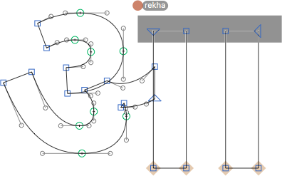
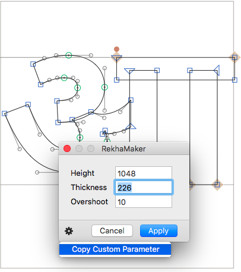

# RekhaViewer and RekhaMaker

This is a set of plugins for the [Glyphs font editor](http://glyphsapp.com/) by Georg Seifert.

RekhaViewer *displays*, and RekhaMaker *creates* a Rekha line in your Bengali, Devanagari, or Gurmukhi letters. In letters containing a `rekha` anchor, the Rekha line will start at the anchor’s x coordinate. This can be useful in letters such as `au-deva`, which do not have a Rekha line that crosses the complete letter width.

### Installation

Either install the plugins via *Window > Plugin Manager*, and restart Glyphs, or:

1. Download the complete ZIP file and unpack it, or clone the repository.
2. Double click the .glyphsFilter and .glyphsReporter files. Confirm the dialogs that appears in Glyphs.
3. Restart Glyphs.

### Usage Instructions: RekhaViewer

1. For every master in *File > Font Info > Masters* (**not** *Instances*), add a custom parameter called `Rekha`, set its value to `height,thickness,overshoot`, e.g., `700,80,10`.
2. Activate it via *View > Show Rekha*.

### Usage Instructions: RekhaMaker

1. Open a glyph in Edit View, or select any number of glyphs in Font or Edit View.
2. Run *Filter > RekhaMaker*, and set the values for *Height*, *Thickness*, and *Overshoot* accordingly.
3. Press the *Insert* button.

Alternatively, you can also use it as a custom parameter on the whole font at export time. Copy the parameter from the gear menu in the lower left. Then paste it in the *Custom Parameters* field in your instance (*File > Font Info > Instances*, **not** *Masters*). For example:

	Property: PreFilter
	Value: RekhaMaker; height:610.0; thickness:80.0; overshoot:10.0;

Using `PreFilter` makes sure you can use the Remove Overlap option in the Export dialog. (If used as `Filter`, you need to add a `Filter:RemoveOverlap;` parameter after it.)

### Requirements

The plugin needs Glyphs 2.3.1 or higher, running on OS X 10.9 or later. I can only test it in current OS versions, and I assume it will not work in older versions.

### License

Copyright 2016 Rainer Erich Scheichelbauer (@mekkablue).
Based on sample code by Jan Gerner (@yanone) and Georg Seifert (@schriftgestalt).

Licensed under the Apache License, Version 2.0 (the "License");
you may not use this file except in compliance with the License.
You may obtain a copy of the License at

http://www.apache.org/licenses/LICENSE-2.0

See the License file included in this repository for further details.
