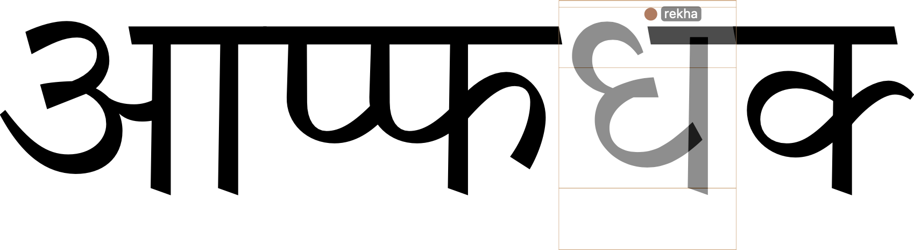
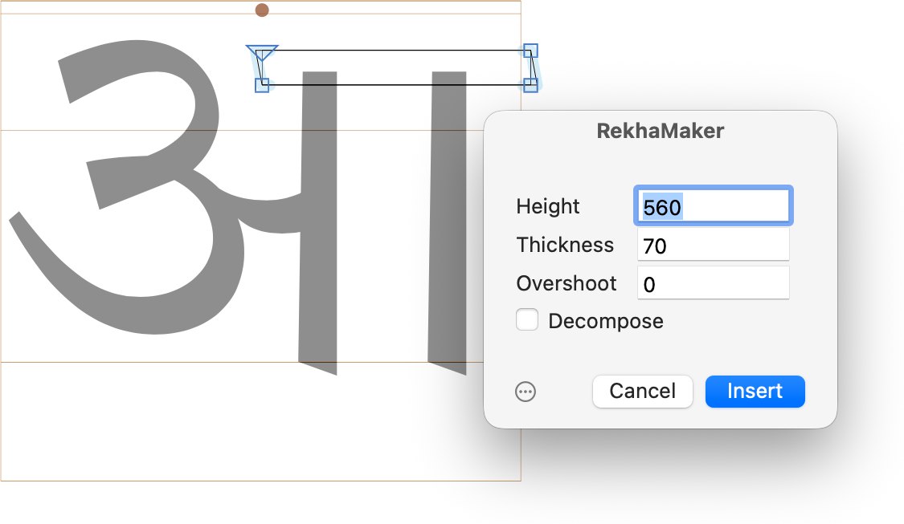
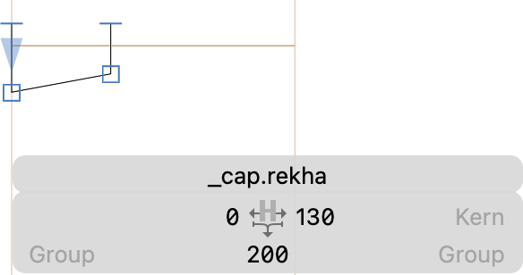

# Rekha plug-in for Glyphs

This is a plugin for the [Glyphs font editor](http://glyphsapp.com/) by Georg Seifert.

The Rekha plug-in *displays* and *creates* a Rekha line in your Bengali, Devanagari, or Gurmukhi letters. There are three properties you can specify in font units:

- **Height:** the height of the lower edge of the Rekha.
- **Thickness:** the stroke thickness of the Rekha.
- **Overshoot:** the amount by which the Rekha will extend beyond the sidebearings.

These properties are supplied differently for each of the use cases (creating vs. displaying). See the usage instructions below for details.

In letters containing a `rekha` anchor, the Rekha line will start at the anchor’s x coordinate. This can be useful in letters such as `au-deva`, which do not have a Rekha line that crosses the complete letter width.

If you supply a `rekha_stop` anchor, a second Rekha will be drawn from the LSB up to that anchor. This can be useful in certain conjuncts that have a gap in the Rekha line.

You can combine both anchors, including multiple arbitrarily suffixed with the same name to have an interrupted line.

### Installation

Install the plugins via *Window > Plugin Manager*, and restart Glyphs.

### View > Show Rekha

1. For every master in *File > Font Info > Masters* (**not** *Exports*), add a custom parameter called `Rekha`, set its value to `height,thickness,overshoot`, e.g., `700,80,10`.
2. Activate it via *View > Show Rekha*.

The preview will respect any `rekha` and `rekha_stop` anchors, if present in the glyph.

### Filter > RekhaMaker

1. Open a glyph in Edit View, or select any number of glyphs in Font or Edit View.
2. Run *Filter > RekhaMaker*, and set the values for *Height*, *Thickness*, and *Overshoot* accordingly.
3. Press the *Insert* button.

The filter will respect any `rekha` and `rekha_stop` anchors, if present in the glyph.

Alternatively, you can use it as a custom parameter on the whole font at export time. Copy the parameter from the gear menu in the lower left. Then paste it in the *Custom Parameters* field in your instance (*File > Font Info > Exports*, **not** *Masters*). For example:

	Property: PreFilter
	Value: RekhaMaker; height:610.0; thickness:80.0; overshoot:10.0;

Using `PreFilter` makes sure you can use the Remove Overlap option in the Export dialog. (If used as `Filter`, you need to add a `Filter:RemoveOverlap;` parameter after it.)

You can copy the filter code (for pasting in *Font Info > Export > Custom Parameters*) from the Actions menu  (triple-dot symbol) of the filter dialog.

### Cap Component

If you have a cap component called `_cap.rekha` in your font, it will be automatically inserted (and fitted) at the end of your Rekha line. 

Hint: Draw the cap counter-clockwise, and vertically at the origin point, with the open path ends pointing upwards. The first point should have x=0. Make it as wide as the Rekha line is high:

Power user tip 1: You can also run _Glyph > Add Rekha Cap_ to achieve the same goal. The menu item is only active if the current font file has Devanagari glyphs. It will not overwrite an existing `_cap.rekha`.

Power user tip 2: If you want to have different strokebutts for the left and right end of the stroke, call them `_cap.rekhaLeft` and/or `_cap.rekhaRight`, respectively.

### Requirements

The plug-in needs Glyphs 3 or higher.

### License

Copyright 2016-2026 Rainer Erich Scheichelbauer (@mekkablue).

Licensed under the Apache License, Version 2.0 (the "License");
you may not use this file except in compliance with the License.
You may obtain a copy of the License at

http://www.apache.org/licenses/LICENSE-2.0

See the License file included in this repository for further details.
